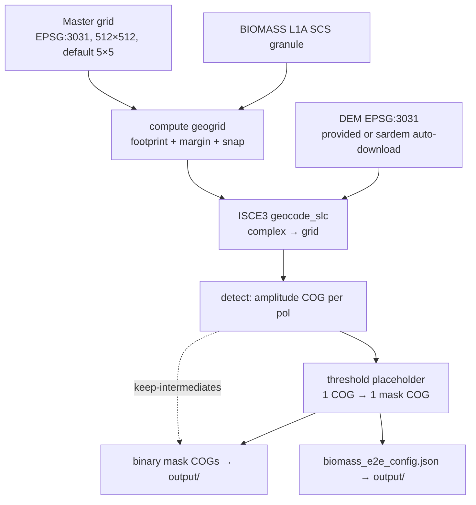
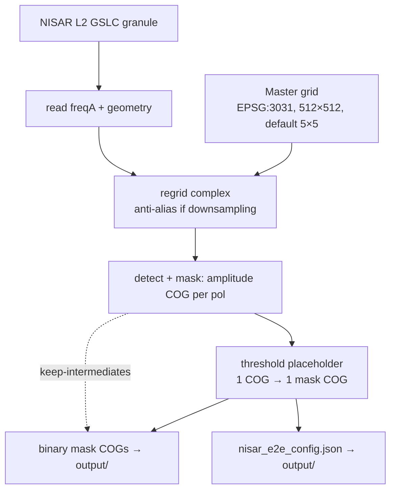

# End-to-End Pipelines

`rift` exposes **two independent end-to-end workflows**, one per sensor. BIOMASS and NISAR
are **not** fused yet — there is no step that combines them (deferred to a later phase).
Each workflow is a single MAAP DPS job: it ingests one granule (+ optional DEM for
BIOMASS), produces amplitude COGs and binary-mask COGs on the master grid, and writes a
resolved-config JSON. Intermediate amplitude COGs are deleted by default to minimize
egress; `--keep-intermediates` keeps them.

Cross-granule fan-out, scheduling, and retries are handled by **MAAP DPS / AWS Batch** —
not by `rift`.

## BIOMASS workflow



## NISAR workflow



## Per-granule sequence (either workflow)

```mermaid
sequenceDiagram
    participant R as run_end_to_end
    participant S as sensor step
    participant IF as infer
    R->>S: produce amplitude COGs (local workdir)
    loop each amplitude COG
        R->>IF: threshold(cog, T) to binary mask COG (output/)
    end
    R->>R: keep or delete amp COGs; write config.json to output/
```

## Code layers

| Layer | Module | Responsibility |
|-------|--------|----------------|
| Grid | `rift/grid.py` | `AntarcticaGrid` (parameterized spacing, default 5×5), snap/geogrid helpers, `with_spacing()` |
| BIOMASS | `rift/biomass/{geogrid,geocode}.py` | footprint→geogrid; ISCE3 geocode→amplitude COG |
| NISAR | `rift/nisar/{extract,regrid}.py` | freqA amplitude+masks; complex regrid to master grid |
| DEM | `rift/dem.py` | `ensure_dem()` — use `--dem` if given, else sardem download |
| Inference | `rift/infer/threshold.py` | placeholder: one COG → one binary-mask COG |
| COG I/O | `rift/cogutil.py` | shared temp-GeoTIFF + `gdal_translate`→COG helper |
| Pipeline | `rift/pipeline.py` | `run_biomass_end_to_end` / `run_nisar_end_to_end` + step fns |
| CLI | `rift/cli.py` | `rift biomass-e2e \| nisar-e2e \| biomass2cog \| nisar2cog \| biomass-infer \| nisar-infer \| validate` |

## MAAP packaging

Two registerable algorithms, one per sensor, under `maap/`:

| Dir | Files | Job |
|-----|-------|-----|
| `maap/biomass_e2e/` | `algorithm_config.yaml`, `run.sh`, `build-env.sh` | BIOMASS granule (+DEM) → mask COGs |
| `maap/nisar_e2e/`   | `algorithm_config.yaml`, `run.sh`, `build-env.sh` | NISAR GSLC → mask COGs |

DPS contract: **one job = one granule.** Inputs arrive in `input/`, outputs (COGs +
config JSON) are captured from `output/`; stdout/stderr are preserved as logs. Each
`run.sh` is a thin wrapper that reads `input/`, calls the matching `rift` CLI subcommand,
and writes `output/`.

## Inference placeholder

Consumes **one amplitude COG at a time**: pixels with amplitude `> threshold` → 1, else 0
(NaN → 0, nodata 255). Emits a uint8 binary-mask COG on the identical grid/transform. A
single `--threshold` applies to every COG; per-sensor thresholds are deferred to the real
trained model, which will replace `rift.infer.threshold` while keeping this I/O contract.
